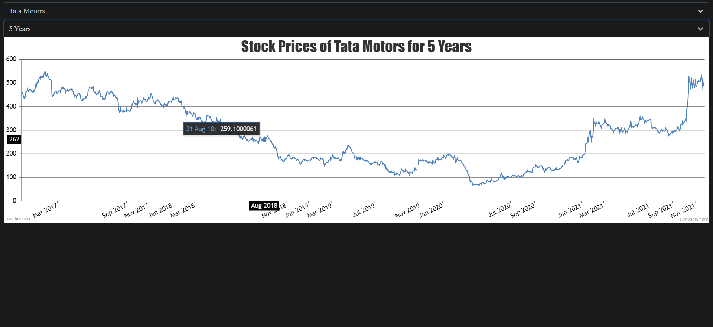

# Getting Started With this Chart
- After changing current directory to stock-chart one can run the project with the command 'npm run start'
- The interface of site is like this one can choose Company Name and Time Period then Chart will displyed.
- The code is in src/App.js file
- If the code doesn't run on your browser try to change your browser CORE settings or install https://chrome.google.com/webstore/detail/moesif-origin-cors-change/digfbfaphojjndkpccljibejjbppifbc this extension on your browser for by-passing the CORE.
- Also to run locally one has to install all these libraries which I had used:
  - react-select (npm install react-select) (For the combo-box)
  - yahoo-stock-prices (npm install yahoo-stock-prices) (For fetching stock prices data)
  - canvasjs-react-charts (npm install canvasjs-react-charts) (For making charts)

